Terraform создаёт kubernates кластер с необходимыми правами /infra
предварительно: созать yc container registry командой
yc container registry create --name fraud-registry
Github Action  разворачивает в облачном кластере Kubernates приложение с api модели. 
Реалтзовано 2 ручки: health и predict. 
Приложение берёт модель из внешнего s3 backet

Для запуска необходимо в Github создать следующие Repository secrets:

YC_CLEAN_BUCKET_AK   - auth key для бакета с моделью

YC_CLEAN_BUCKET_SK   - sekret key для бакета с моделью

YC_K8S_CLUSTER_ID  - ID k8s кластера (yc managed-kubernetes cluster list)

YC_REGISTRY_ID       - id yc registry для рпазмещения образов Docker

YC_SA_JSON_CREDENTIALS - креды для SA

Для локального запуска необходим файл .env c параметрами, собирать образ из файла Dockerfile-local
После выполнения Github Action

kubectl get svc -A

kubectl get svc

curl http://&lt;balancer EXTERNAL-IP&gt;/health

curl -X POST "http://&lt;balancer EXTERNAL-IP&gt;/predict" -H "Content-Type: application/json" \
  -d '{
    "transaction_id": 1,
    "customer_id": 1001,
    "terminal_id": 501,
    "tx_amount": 250.75,
    "tx_time_seconds": 36000,
    "tx_time_days": 12,
    "tx_fraud_scenario": 0
  }'

1. ./model-api/infra

  make apply    # разворачивает kubernates cluster

  make deploy_secrets   # update kubectl, лбновляет secrets .env, доставка secrets в github, k8sbalacer записывает в  terraform.tfvars airflow

2. Terraform monitoring
  ./monitoring

  make apply

  make all

  проброс портов:
  
  kubectl port-forward -n monitoring svc/kube-prometheus-stack-grafana 3000:80
  
  kubectl port-forward -n monitoring svc/prometheus-operated 9090:9090

  Grafana - import dashboard ./monitoring/config/Model_API_Scaling.json

  

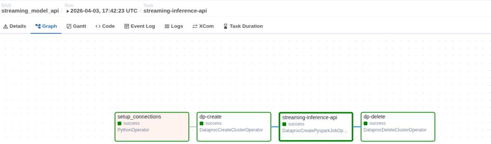

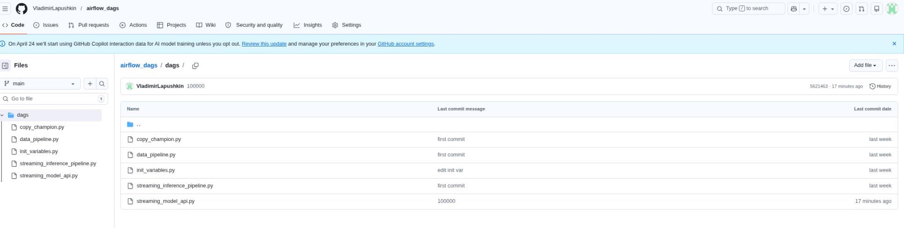
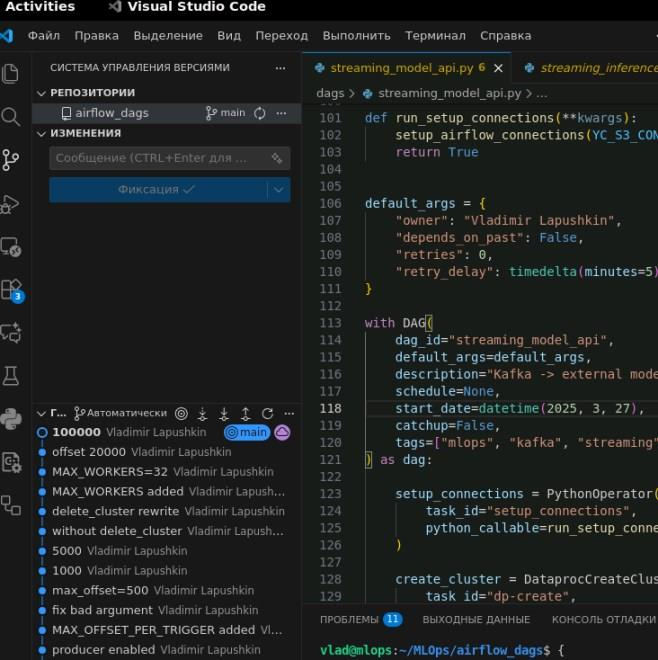
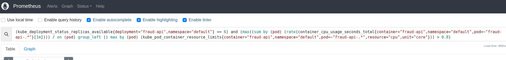
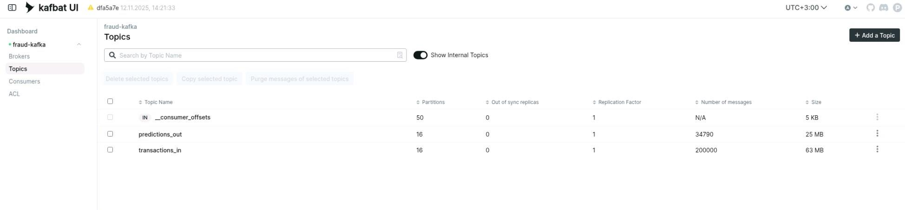
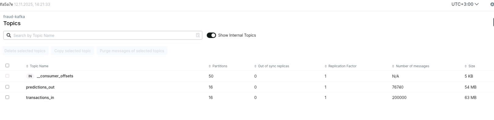
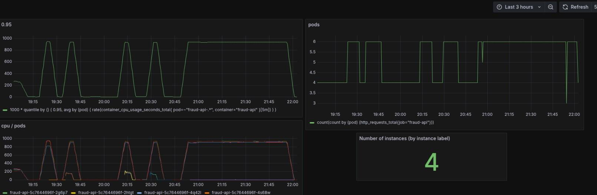
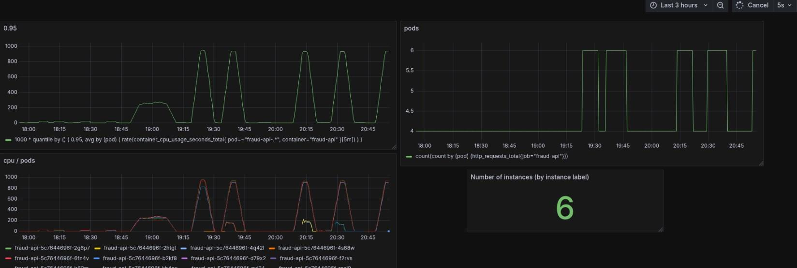
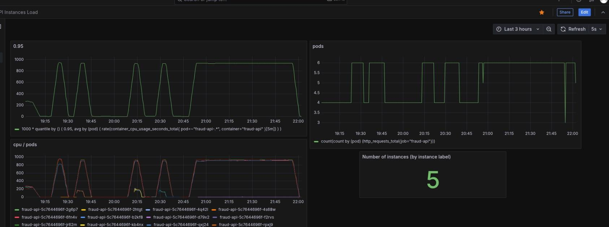
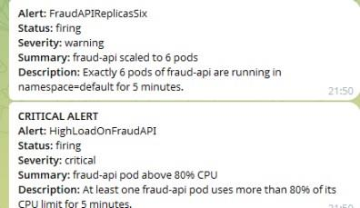
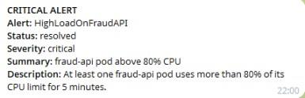

